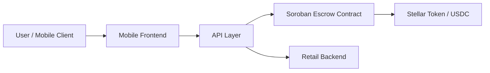

# Velo

[](LICENSE)

Velo is an open-source payment and liquidity platform for privacy-preserving cash access on Stellar. It combines Soroban smart contracts, a lightweight API layer, and a mobile-first experience to make cash-like settlement practical for real-world use cases such as agent-assisted payments, local commerce, and programmable escrow.

## Why Velo Exists

Modern digital payments are fast, but they are often brittle for real-world cash interactions. Velo exists to bridge the gap between on-chain settlement and offline or mediated cash flows by providing a transparent, auditable, and extensible framework for escrow, conditional settlement, and payment-backed access.

## Problem Statement

Many payment systems assume that both parties are already online, wallet-enabled, and comfortable interacting with a blockchain directly. That expectation breaks down in everyday commerce, agent-mediated workflows, and mobile-first environments where users need a simple path to receive value without compromising security or trust.

Velo addresses this gap with a system that:

- supports escrow-based conditional settlement,
- enables payment-backed API access through a simple x402-style flow,
- provides a mobile claim experience for users who interact via QR or shared links,
- keeps core settlement logic verifiable on-chain through Soroban contracts.

## Solution Overview

Velo combines three layers:

1. Soroban smart contracts for escrow and atomic-swap primitives.
2. A TypeScript API layer for orchestration, payment challenge handling, and service access.
3. A mobile frontend and backend for user-facing claim and retail workflows.

The platform is designed to be modular so that contributors can improve one part of the stack without threatening the stability of the rest.

## Architecture Overview

The system is organized around a simple trust model:

- buyers lock funds in escrow,
- sellers or claimants receive funds only when the correct condition is satisfied,
- the API layer exposes the flow to clients and agents,
- the mobile experience provides a lightweight path for users to complete or claim transactions.

For a detailed step-by-step visual sequence of the end-to-end payment and cash request flow, see the [End-to-End Request Flow Diagram](docs/request-flow.md).



## Key Features

- escrow-based conditional payment settlement,
- Soroban-powered smart contract primitives,
- x402-style payment gating for API access,
- QR-based claim flows for mobile users,
- shared contract address registry for consistent integration,
- modular architecture suitable for incremental production rollout.

## Technology Stack

- Rust for Soroban contracts
- TypeScript for API and shared packages
- Fastify for service APIs
- React + Vite for the mobile frontend
- TurboRepo for workspace orchestration
- Managed Redis for distributed trade-chat state and Pub/Sub
- Stellar / Soroban for settlement infrastructure

## Soroban Smart Contracts

The contracts in this repository currently focus on escrow and HTLC-style primitives that make conditional settlement possible. The escrow contract locks funds from a buyer until a release condition is satisfied or a refund condition is reached.

### Deployed Escrow Contract Addresses

The repository keeps escrow contract addresses in the shared registry under [packages/shared/src/index.ts](packages/shared/src/index.ts). The current documented testnet deployment is:

- Testnet escrow: `CAEYSVTKTCZYTSMPD7CU3NOFYOO4S5V6LJLGRNV7LKTNZ65N66PCHLMC`

The mainnet escrow address remains unset until a production deployment is finalized. This separation makes it clear which network a client or integrator should target when interacting with the escrow flow.

## Zero-Knowledge Infrastructure

Velo is also structured around privacy-preserving identity and credential concepts. While the current repository primarily exposes the core payment and escrow workflow, the architecture anticipates future integration with zero-knowledge credential verification and nullifier-based privacy primitives.

## API Overview

The API layer provides the integration surface for clients and agents. It exposes routes for:

- service discovery,
- cash request orchestration,
- payment challenge responses,
- reputation and provider discovery concepts.

### Agent Integration & Worked Examples

Velo is designed for direct consumption by autonomous AI agents, Telegram bots, and automated client applications. Agents interact with the API layer to discover local liquidity providers, lock cash requests in Soroban escrow, and receive a user-facing claim link.

For a complete end-to-end worked example, see [examples/telegram_bot.js](examples/telegram_bot.js). This minimal runnable Telegram bot script demonstrates how an agent can:
1. Query available cash providers via `GET /api/v1/cash/agents`
2. Create an escrow cash request via `POST /api/v1/cash/request`
3. Retrieve and present the resulting `claim_url` to the end user

## Mobile Application

The mobile experience is intentionally lightweight and QR-centric. It allows a user to claim or complete a payment flow without requiring a full wallet-native experience at the first step.

## Provider Identity Verification

Provider onboarding uses a lightweight manual-review workflow rather than a full KYC service:

1. `POST /api/v1/provider/register` creates the provider with verification status `pending`.
2. The registration UI immediately uploads one private identity-document image to `POST /api/v1/provider/verification-document`. JPEG, PNG, and WebP files up to 5 MB are accepted and checked against their file signatures.
3. An operator authenticated with `x-admin-api-key` reviews submissions through `GET /api/v1/admin/providers/verifications`, retrieves a private document through `GET /api/v1/admin/providers/:providerId/verifications/:documentId`, and records a decision with `POST /api/v1/admin/providers/:id/verification` using `{"status":"approved"}` or `{"status":"rejected"}`.

The states are `pending` (awaiting review), `approved` (eligible for public directory and default cash matching), and `rejected` (not eligible; a new document submission returns the provider to `pending`). Verification documents are never returned by public provider APIs. Deployments using PostgreSQL must apply migration `007_add_provider_verification.sql`; operators should restrict database and admin-endpoint access because uploaded identity images are sensitive.

## Installation

### Prerequisites

- Node.js 20 or newer
- npm 10 or newer
- Rust toolchain
- wasm target: `wasm32v1-none`
- Soroban CLI or Stellar CLI
- A funded Stellar testnet account

### Bootstrap

```bash
git clone https://github.com/Nullifier-Systems/velo.git
cd velo
npm install
cp apps/api/.env.example apps/api/.env
cp mobile/backend/.env.example mobile/backend/.env
```

For the full ordered local setup walkthrough, including the Rust and Soroban prerequisites plus the Windows-specific gotchas, see [docs/development.md](docs/development.md).

## Local Development

Run the workspace using TurboRepo:

```bash
npm run dev
```

Run individual services:

```bash
npm run dev:api
npm run dev:backend
npm run dev:frontend
```

### Distributed WebSocket chat

Trade chat requires a Redis-compatible managed service in deployed environments. Set `REDIS_URL` to its connection URL and set `CHAT_CAPABILITY_SECRET` to at least 32 random characters. Optional settings are `CHAT_CAPABILITY_TTL_SECONDS` (default `3600`) and `CHAT_HEARTBEAT_INTERVAL_MS` (default `30000`). Local development falls back to process-local state when `REDIS_URL` is absent; that fallback is not suitable for multi-instance deployments.

The backend issues a short-lived capability bound to one `{tradeId, participant}` pair through the existing buyer claim and seller dashboard flows. The client presents it during the WebSocket handshake. The server verifies its signature and expiry, loads shared trade membership from Redis, and admits only the recorded buyer or seller. HTTP chat history and encryption-key routes require the same token as a Bearer credential.

Each API instance subscribes to a Redis channel only while it owns connections for that trade. Ciphertext is persisted before publication, so clients reconnect with the last received message ID and replay anything missed. Server heartbeat pings remove dropped connections, while clients reconnect with bounded exponential backoff. Serverless deployments must support WebSocket upgrades and long-lived connections, permit outbound Redis connections, and use the same Redis database and capability secret on every instance.

## Running Tests

```bash
npm run localization:check
npm run test
cd contracts && cargo test --workspace
```

When adding user-facing text, add matching keys to the English and Spanish
catalogs under `mobile/frontend/src/i18n/locales/` (or
`apps/api/src/i18n/locales/` for API messages) and render the text through the
project's translation helper. `npm run localization:check` mirrors CI and fails
on unmatched catalog keys or placeholders, unknown translation keys, and newly
hardcoded frontend text. See [CONTRIBUTING.md](CONTRIBUTING.md#localization) for
the full contributor workflow.

## Repository Structure

```text
apps/
  api/                API gateway and payment-aware routes
mobile/
  frontend/           React/Vite consumer app
  backend/            retail and matching-service scaffold
contracts/
  escrow/             escrow contract
  atomic-swap/        atomic swap contract scaffold
  htlc-core/          shared HTLC abstractions
packages/
  shared/             shared constants, contract metadata, and types
docs/                contributor and architecture documentation
```

## Documentation Links

- [docs/request-flow.md](docs/request-flow.md) (End-to-End Request Flow Diagram)
- [docs/architecture.md](docs/architecture.md)
- [docs/smart-contracts.md](docs/smart-contracts.md)
- [docs/api.md](docs/api.md)
- [docs/development.md](docs/development.md)
- [docs/testing.md](docs/testing.md)
- [examples/telegram_bot.js](examples/telegram_bot.js) (Telegram Bot Agent Worked Example)

## Security

Security is a first-class concern. Please review [SECURITY.md](SECURITY.md) before reporting vulnerabilities. Do not open public issues for security-sensitive findings.

## Contributing

Contributions are welcome. Please read [CONTRIBUTING.md](CONTRIBUTING.md) before opening a pull request.

## Roadmap

The near-term roadmap focuses on hardening the escrow flow, improving contract coverage, documenting the payment integration path, and expanding the mobile claim experience.

## Frequently Asked Questions

### Is Velo production-ready?

Velo is an actively evolving platform. The core contracts and integrations are present, but contributors should expect some areas to remain in active development.

### Is the repository open source?

Yes. Velo is released under the [Apache License 2.0](LICENSE) and is intended for open collaboration and public review.

### Where should I start?

A good entry point is the escrow contract, the API routes, and the mobile claim experience.

## License

This project is licensed under the Apache License 2.0. See [LICENSE](LICENSE) for details.

## Acknowledgements

Velo builds on the work of the Stellar, Soroban, Fastify, React, and Rust ecosystems. It is maintained by Nullifier Systems and the wider contributor community.
